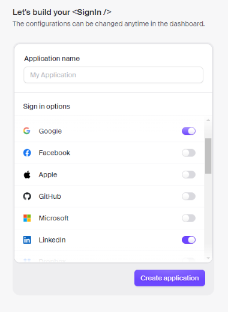

# Setup

## Clone Github Repository

Run the following command in the CLI to clone down the repository

```bash
git clone https://github.com/NTIG-Uppsala/Stuns-Aterbrukslabbet.git
```

## Download Node.js and necessary packages

Download Node.js at this [link](https://nodejs.org/en/download)

For this project we use Node.js version 20.11.0

Run the following command in the CLI to get the necessary packages from the node package manager.

```bash
npm install
```

## Set up Clerk authentication

- If you already have a clerk application, create a `.env` file in the root folder of the project.

- Go to the API Keys tab in the clerk dashboard to find your NEXT_PUBLIC_CLERK_PUBLISHABLE_KEY and the CLERK_SECRET_KEY.

- Paste the API Keys and following clerk code in the `.env` file and make sure the file looks like this.


### Creating a new clerk application

- Go to the [clerk website]("https://clerk.com/") and create an account and a clerk application if you do not already have one.

- When creating a clerk application you will need to enable Google, LinkedIn and email as sign in options. This can also be changed later in the User & Authentication tab in the clerk dashboard.



- Go to the API Keys tab in the clerk dashboard to find your NEXT_PUBLIC_CLERK_PUBLISHABLE_KEY and the CLERK_SECRET_KEY.

- You will then need to create a `.env` file in the root folder of your project. Paste the API Keys in there and following clerk code. Make sure your `.env` file looks like this.


